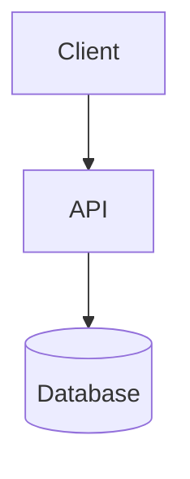
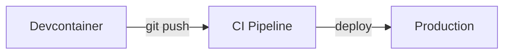

# Architecture

> **Living document** — the single source of truth for how this project is built, deployed, and operated. Update it when a technology choice is made, the system structure changes, or deployment/tooling changes. Use [Mermaid](https://mermaid.js.org/) diagrams for anything structural.

## Tech Stack

<!-- Fill this out during Phase 1: Discovery (see AGENTS.md). When the stack is chosen:
     update .devcontainer/, map commands in the Makefile, configure dependabot.yml,
     and record the choice in the Decision Log below. -->

- **Core language:** [e.g., TypeScript on Node.js 24]
- **Frameworks:** [backend / frontend]
- **Testing:** [unit / end-to-end]
- **Data & storage:** [database, cache, file storage]

## System Overview

[One paragraph describing the major components and how they talk to each other, followed by a diagram.]

## Deployment & Environments

[Where this runs, how it gets there, and what environments exist.]

## Tooling

[Anything a fresh session needs to know about build tools, code generation, linters, or infrastructure-as-code that isn't obvious from the Makefile.]

## Operations Runbook

<!-- How to deploy, roll back, and diagnose. Where logs/monitoring live. What to check first when something breaks. -->

- **Deploy:** [command / process]
- **Rollback:** [command / process]
- **Logs & monitoring:** [where to look]

## Decision Log

> Append-only. One line per significant technical decision — enough for a future session to understand _why_ without re-litigating it.

| Date         | Decision                     | Why                                     |
| ------------ | ---------------------------- | --------------------------------------- |
| [YYYY-MM-DD] | [e.g., Postgres over SQLite] | [e.g., need concurrent writers in prod] |
